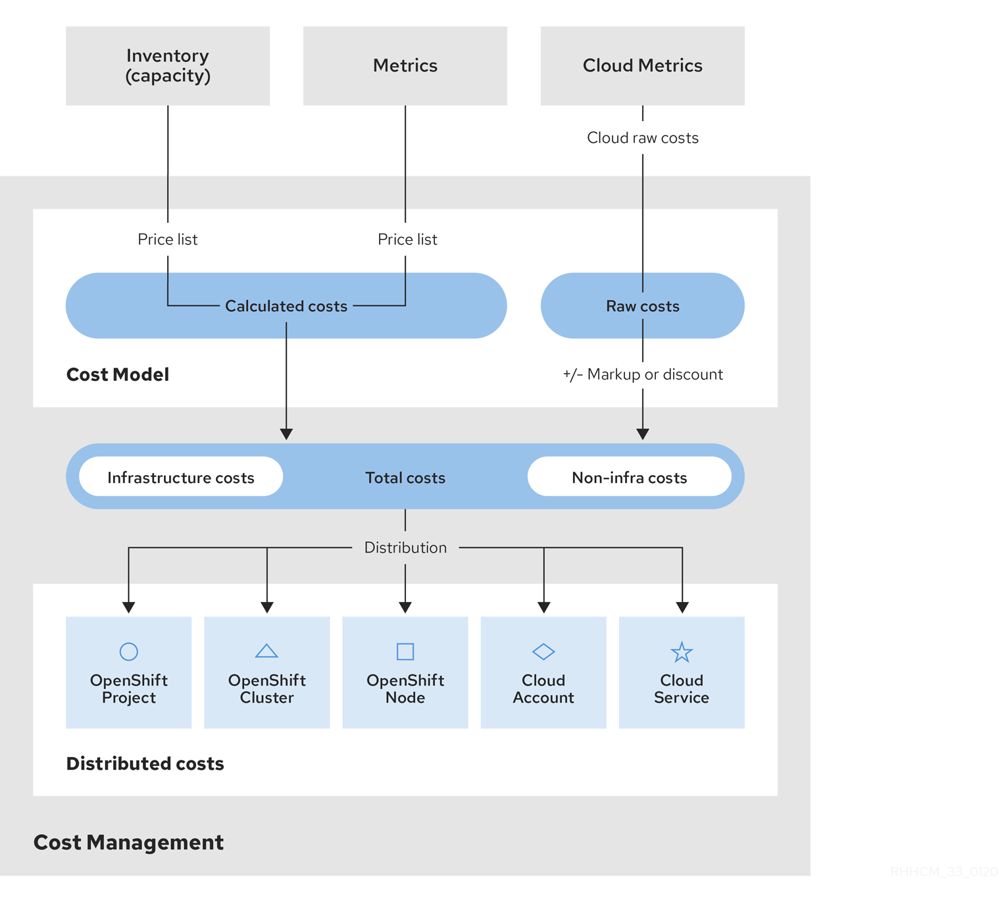

// Module included in the following assemblies:
//
// assembly-using-cost-models.adoc
:_module-type: CONCEPT
:experimental:

[id="cost-model-workflow_{context}"]

= The cost model workflow

[role="_abstract"]
The following diagram shows the cost model workflow that cost management uses to apply a price to metrics and inventory, normalize cost data from different sources, apply a markup (or discount), then distribute the costs across the relevant resources.

The cost model also helps differentiate raw costs from the costs used in cost management.

. Cost management collects cost data from several sources:
* *Inventory* - A list of all resources that are or were running in your source, whether they are presently in use or not. For example, if your OpenShift Container Platform environment contains a node that is not in use, that node still costs _$x_ amount per month. There are several ways of collecting inventory data into cost management: cost management can generate inventory from the AWS Cost and Usage Report, Azure export, or OpenShift Metering Operator reports.
* *Metrics* - A subset of the OpenShift inventory showing usage and consumption for each resource.
* *Cloud raw costs* - AWS and Azure provide regular reports to cost management listing hourly consumption of resources and their costs, which cost management uses as is in calculations. As a result, configuring a custom price list is not necessary for cloud sources.
. The *cost model* allows you to apply a markup or discount of your choice to account for other costs and overhead, and provides options for assigning a cost layer (infrastructure or supplementary) to costs:
.. For OpenShift Container Platform sources - Since the metrics and inventory data do not have a price assigned to usage, you must create and assign a *price list* to your sources to determine the *usage cost* of these resources. A price list includes rates for storage, memory, CPU usage and requests, and clusters and nodes.
.. For AWS and Azure sources - You can create cost models for these sources to account for any extra costs or overhead in your environment by applying a *markup* percentage, or a negative percentage to calculate a discount.
. Costs from sources are then collected together and allocated as *infrastructure cost* and *supplementary cost*.
. The cost is then *distributed* to resources across the environment. Depending on your organization, these resources may include OpenShift projects, nodes, or clusters, and AWS or Azure services or accounts. You can also use tagging to distribute the costs by team, project, or group within your organization.

[NOTE]
====
For more information about configuring tagging for cost management, see _{link-tagging}_.
====
