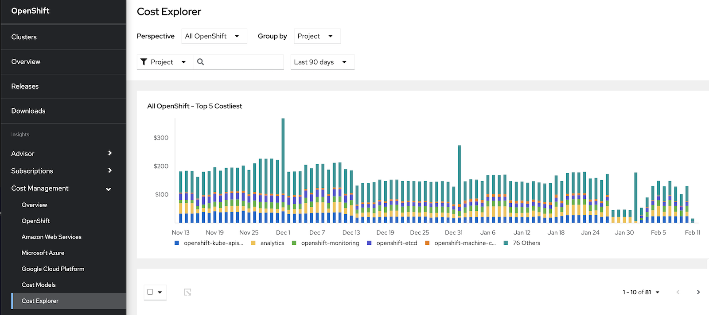

// Module included in the following assemblies:
// assembly-using-cost-explorer.adoc
:_content-type: CONCEPT
:experimental:

[id="understanding-cost-explorer_{context}"]
= Understanding Cost Explorer

[role="_abstract"] 

The cost management {link-cost-explorer-app} allows you to create custom graphs containing up to 90 days of cost and usage information to better visualize and interpret your costs.

With Cost Explorer you can:

* Identify abnormal events.
* Understand how you cost data changes over time.
* Create custom bar charts of your cost and usage data.
* Export custom cost data files.

.The Cost Explorer Interface

A single bar in the Cost Explorer chart represents one day of cost and usage data corresponding to the filtered options. The five most significant metrics are individually displayed and all other metrics placed into the _Others_ category. See xref:filtering-cost-data-cost-explorer_cost-explorer[] for more information on filtering your cost and usage data. 

